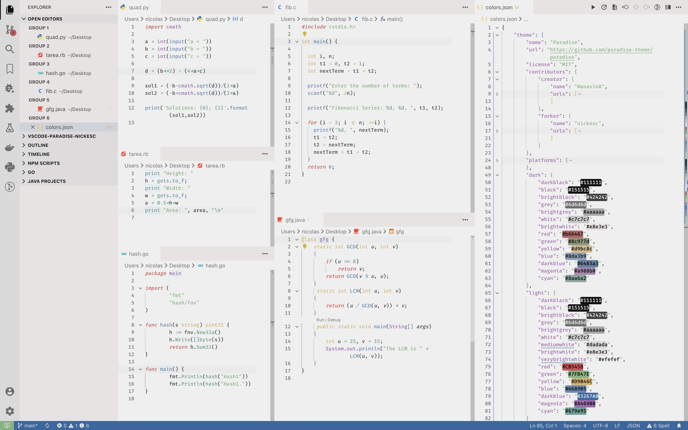

<div align="center">
  <a href="https://github.com/nickesc/vscode-paradise-nickesc"></a>
  <a href="https://github.com/nickesc/vscode-paradise-nickesc/actions/workflows/publish-extension.yml"></a>
  <br>
    <a href="https://marketplace.visualstudio.com/items?itemName=nickesc.vscode-paradise-nickesc"><img alt="Visual Studio Marketplace: https://marketplace.visualstudio.com/items?itemName=nickesc.vscode-paradise-nickesc" src="https://img.shields.io/visual-studio-marketplace/v/nickesc.vscode-paradise-nickesc?style=for-the-badge&logo=data%3Aimage%2Fsvg%2Bxml%3Bbase64%2CPHN2ZyB2aWV3Qm94PSIwIDAgMTAwIDEwMCIgZmlsbD0ibm9uZSIgeG1sbnM9Imh0dHA6Ly93d3cudzMub3JnLzIwMDAvc3ZnIj4KPG1hc2sgaWQ9Im1hc2swIiBtYXNrLXR5cGU9ImFscGhhIiBtYXNrVW5pdHM9InVzZXJTcGFjZU9uVXNlIiB4PSIwIiB5PSIwIiB3aWR0aD0iMTAwIiBoZWlnaHQ9IjEwMCI%2BCjxwYXRoIGZpbGwtcnVsZT0iZXZlbm9kZCIgY2xpcC1ydWxlPSJldmVub2RkIiBkPSJNNzAuOTExOSA5OS4zMTcxQzcyLjQ4NjkgOTkuOTMwNyA3NC4yODI4IDk5Ljg5MTQgNzUuODcyNSA5OS4xMjY0TDk2LjQ2MDggODkuMjE5N0M5OC42MjQyIDg4LjE3ODcgMTAwIDg1Ljk4OTIgMTAwIDgzLjU4NzJWMTYuNDEzM0MxMDAgMTQuMDExMyA5OC42MjQzIDExLjgyMTggOTYuNDYwOSAxMC43ODA4TDc1Ljg3MjUgMC44NzM3NTZDNzMuNzg2MiAtMC4xMzAxMjkgNzEuMzQ0NiAwLjExNTc2IDY5LjUxMzUgMS40NDY5NUM2OS4yNTIgMS42MzcxMSA2OS4wMDI4IDEuODQ5NDMgNjguNzY5IDIuMDgzNDFMMjkuMzU1MSAzOC4wNDE1TDEyLjE4NzIgMjUuMDA5NkMxMC41ODkgMjMuNzk2NSA4LjM1MzYzIDIzLjg5NTkgNi44NjkzMyAyNS4yNDYxTDEuMzYzMDMgMzAuMjU0OUMtMC40NTI1NTIgMzEuOTA2NCAtMC40NTQ2MzMgMzQuNzYyNyAxLjM1ODUzIDM2LjQxN0wxNi4yNDcxIDUwLjAwMDFMMS4zNTg1MyA2My41ODMyQy0wLjQ1NDYzMyA2NS4yMzc0IC0wLjQ1MjU1MiA2OC4wOTM4IDEuMzYzMDMgNjkuNzQ1M0w2Ljg2OTMzIDc0Ljc1NDFDOC4zNTM2MyA3Ni4xMDQzIDEwLjU4OSA3Ni4yMDM3IDEyLjE4NzIgNzQuOTkwNUwyOS4zNTUxIDYxLjk1ODdMNjguNzY5IDk3LjkxNjdDNjkuMzkyNSA5OC41NDA2IDcwLjEyNDYgOTkuMDEwNCA3MC45MTE5IDk5LjMxNzFaTTc1LjAxNTIgMjcuMjk4OUw0NS4xMDkxIDUwLjAwMDFMNzUuMDE1MiA3Mi43MDEyVjI3LjI5ODlaIiBmaWxsPSJ3aGl0ZSIvPgo8L21hc2s%2BCjxnIG1hc2s9InVybCgjbWFzazApIj4KPHBhdGggZD0iTTk2LjQ2MTQgMTAuNzk2Mkw3NS44NTY5IDAuODc1NTQyQzczLjQ3MTkgLTAuMjcyNzczIDcwLjYyMTcgMC4yMTE2MTEgNjguNzUgMi4wODMzM0wxLjI5ODU4IDYzLjU4MzJDLTAuNTE1NjkzIDY1LjIzNzMgLTAuNTEzNjA3IDY4LjA5MzcgMS4zMDMwOCA2OS43NDUyTDYuODEyNzIgNzQuNzU0QzguMjk3OTMgNzYuMTA0MiAxMC41MzQ3IDc2LjIwMzYgMTIuMTMzOCA3NC45OTA1TDkzLjM2MDkgMTMuMzY5OUM5Ni4wODYgMTEuMzAyNiAxMDAgMTMuMjQ2MiAxMDAgMTYuNjY2N1YxNi40Mjc1QzEwMCAxNC4wMjY1IDk4LjYyNDYgMTEuODM3OCA5Ni40NjE0IDEwLjc5NjJaIiBmaWxsPSIjMDA2NUE5Ii8%2BCjxnIGZpbHRlcj0idXJsKCNmaWx0ZXIwX2QpIj4KPHBhdGggZD0iTTk2LjQ2MTQgODkuMjAzOEw3NS44NTY5IDk5LjEyNDVDNzMuNDcxOSAxMDAuMjczIDcwLjYyMTcgOTkuNzg4NCA2OC43NSA5Ny45MTY3TDEuMjk4NTggMzYuNDE2OUMtMC41MTU2OTMgMzQuNzYyNyAtMC41MTM2MDcgMzEuOTA2MyAxLjMwMzA4IDMwLjI1NDhMNi44MTI3MiAyNS4yNDZDOC4yOTc5MyAyMy44OTU4IDEwLjUzNDcgMjMuNzk2NCAxMi4xMzM4IDI1LjAwOTVMOTMuMzYwOSA4Ni42MzAxQzk2LjA4NiA4OC42OTc0IDEwMCA4Ni43NTM4IDEwMCA4My4zMzM0VjgzLjU3MjZDMTAwIDg1Ljk3MzUgOTguNjI0NiA4OC4xNjIyIDk2LjQ2MTQgODkuMjAzOFoiIGZpbGw9IiMwMDdBQ0MiLz4KPC9nPgo8ZyBmaWx0ZXI9InVybCgjZmlsdGVyMV9kKSI%2BCjxwYXRoIGQ9Ik03NS44NTc4IDk5LjEyNjNDNzMuNDcyMSAxMDAuMjc0IDcwLjYyMTkgOTkuNzg4NSA2OC43NSA5Ny45MTY2QzcxLjA1NjQgMTAwLjIyMyA3NSA5OC41ODk1IDc1IDk1LjMyNzhWNC42NzIxM0M3NSAxLjQxMDM5IDcxLjA1NjQgLTAuMjIzMTA2IDY4Ljc1IDIuMDgzMjlDNzAuNjIxOSAwLjIxMTQwMiA3My40NzIxIC0wLjI3MzY2NiA3NS44NTc4IDAuODczNjMzTDk2LjQ1ODcgMTAuNzgwN0M5OC42MjM0IDExLjgyMTcgMTAwIDE0LjAxMTIgMTAwIDE2LjQxMzJWODMuNTg3MUMxMDAgODUuOTg5MSA5OC42MjM0IDg4LjE3ODYgOTYuNDU4NiA4OS4yMTk2TDc1Ljg1NzggOTkuMTI2M1oiIGZpbGw9IiMxRjlDRjAiLz4KPC9nPgo8ZyBzdHlsZT0ibWl4LWJsZW5kLW1vZGU6b3ZlcmxheSIgb3BhY2l0eT0iMC4yNSI%2BCjxwYXRoIGZpbGwtcnVsZT0iZXZlbm9kZCIgY2xpcC1ydWxlPSJldmVub2RkIiBkPSJNNzAuODUxMSA5OS4zMTcxQzcyLjQyNjEgOTkuOTMwNiA3NC4yMjIxIDk5Ljg5MTMgNzUuODExNyA5OS4xMjY0TDk2LjQgODkuMjE5N0M5OC41NjM0IDg4LjE3ODcgOTkuOTM5MiA4NS45ODkyIDk5LjkzOTIgODMuNTg3MVYxNi40MTMzQzk5LjkzOTIgMTQuMDExMiA5OC41NjM1IDExLjgyMTcgOTYuNDAwMSAxMC43ODA3TDc1LjgxMTcgMC44NzM2OTVDNzMuNzI1NSAtMC4xMzAxOSA3MS4yODM4IDAuMTE1Njk5IDY5LjQ1MjcgMS40NDY4OEM2OS4xOTEyIDEuNjM3MDUgNjguOTQyIDEuODQ5MzcgNjguNzA4MiAyLjA4MzM1TDI5LjI5NDMgMzguMDQxNEwxMi4xMjY0IDI1LjAwOTZDMTAuNTI4MyAyMy43OTY0IDguMjkyODUgMjMuODk1OSA2LjgwODU1IDI1LjI0NkwxLjMwMjI1IDMwLjI1NDhDLTAuNTEzMzM0IDMxLjkwNjQgLTAuNTE1NDE1IDM0Ljc2MjcgMS4yOTc3NSAzNi40MTY5TDE2LjE4NjMgNTBMMS4yOTc3NSA2My41ODMyQy0wLjUxNTQxNSA2NS4yMzc0IC0wLjUxMzMzNCA2OC4wOTM3IDEuMzAyMjUgNjkuNzQ1Mkw2LjgwODU1IDc0Ljc1NEM4LjI5Mjg1IDc2LjEwNDIgMTAuNTI4MyA3Ni4yMDM2IDEyLjEyNjQgNzQuOTkwNUwyOS4yOTQzIDYxLjk1ODZMNjguNzA4MiA5Ny45MTY3QzY5LjMzMTcgOTguNTQwNSA3MC4wNjM4IDk5LjAxMDQgNzAuODUxMSA5OS4zMTcxWk03NC45NTQ0IDI3LjI5ODlMNDUuMDQ4MyA1MEw3NC45NTQ0IDcyLjcwMTJWMjcuMjk4OVoiIGZpbGw9InVybCgjcGFpbnQwX2xpbmVhcikiLz4KPC9nPgo8L2c%2BCjxkZWZzPgo8ZmlsdGVyIGlkPSJmaWx0ZXIwX2QiIHg9Ii04LjM5NDExIiB5PSIxNS44MjkxIiB3aWR0aD0iMTE2LjcyNyIgaGVpZ2h0PSI5Mi4yNDU2IiBmaWx0ZXJVbml0cz0idXNlclNwYWNlT25Vc2UiIGNvbG9yLWludGVycG9sYXRpb24tZmlsdGVycz0ic1JHQiI%2BCjxmZUZsb29kIGZsb29kLW9wYWNpdHk9IjAiIHJlc3VsdD0iQmFja2dyb3VuZEltYWdlRml4Ii8%2BCjxmZUNvbG9yTWF0cml4IGluPSJTb3VyY2VBbHBoYSIgdHlwZT0ibWF0cml4IiB2YWx1ZXM9IjAgMCAwIDAgMCAwIDAgMCAwIDAgMCAwIDAgMCAwIDAgMCAwIDEyNyAwIi8%2BCjxmZU9mZnNldC8%2BCjxmZUdhdXNzaWFuQmx1ciBzdGREZXZpYXRpb249IjQuMTY2NjciLz4KPGZlQ29sb3JNYXRyaXggdHlwZT0ibWF0cml4IiB2YWx1ZXM9IjAgMCAwIDAgMCAwIDAgMCAwIDAgMCAwIDAgMCAwIDAgMCAwIDAuMjUgMCIvPgo8ZmVCbGVuZCBtb2RlPSJvdmVybGF5IiBpbjI9IkJhY2tncm91bmRJbWFnZUZpeCIgcmVzdWx0PSJlZmZlY3QxX2Ryb3BTaGFkb3ciLz4KPGZlQmxlbmQgbW9kZT0ibm9ybWFsIiBpbj0iU291cmNlR3JhcGhpYyIgaW4yPSJlZmZlY3QxX2Ryb3BTaGFkb3ciIHJlc3VsdD0ic2hhcGUiLz4KPC9maWx0ZXI%2BCjxmaWx0ZXIgaWQ9ImZpbHRlcjFfZCIgeD0iNjAuNDE2NyIgeT0iLTguMDc1NTgiIHdpZHRoPSI0Ny45MTY3IiBoZWlnaHQ9IjExNi4xNTEiIGZpbHRlclVuaXRzPSJ1c2VyU3BhY2VPblVzZSIgY29sb3ItaW50ZXJwb2xhdGlvbi1maWx0ZXJzPSJzUkdCIj4KPGZlRmxvb2QgZmxvb2Qtb3BhY2l0eT0iMCIgcmVzdWx0PSJCYWNrZ3JvdW5kSW1hZ2VGaXgiLz4KPGZlQ29sb3JNYXRyaXggaW49IlNvdXJjZUFscGhhIiB0eXBlPSJtYXRyaXgiIHZhbHVlcz0iMCAwIDAgMCAwIDAgMCAwIDAgMCAwIDAgMCAwIDAgMCAwIDAgMTI3IDAiLz4KPGZlT2Zmc2V0Lz4KPGZlR2F1c3NpYW5CbHVyIHN0ZERldmlhdGlvbj0iNC4xNjY2NyIvPgo8ZmVDb2xvck1hdHJpeCB0eXBlPSJtYXRyaXgiIHZhbHVlcz0iMCAwIDAgMCAwIDAgMCAwIDAgMCAwIDAgMCAwIDAgMCAwIDAgMC4yNSAwIi8%2BCjxmZUJsZW5kIG1vZGU9Im92ZXJsYXkiIGluMj0iQmFja2dyb3VuZEltYWdlRml4IiByZXN1bHQ9ImVmZmVjdDFfZHJvcFNoYWRvdyIvPgo8ZmVCbGVuZCBtb2RlPSJub3JtYWwiIGluPSJTb3VyY2VHcmFwaGljIiBpbjI9ImVmZmVjdDFfZHJvcFNoYWRvdyIgcmVzdWx0PSJzaGFwZSIvPgo8L2ZpbHRlcj4KPGxpbmVhckdyYWRpZW50IGlkPSJwYWludDBfbGluZWFyIiB4MT0iNDkuOTM5MiIgeTE9IjAuMjU3ODEyIiB4Mj0iNDkuOTM5MiIgeTI9Ijk5Ljc0MjMiIGdyYWRpZW50VW5pdHM9InVzZXJTcGFjZU9uVXNlIj4KPHN0b3Agc3RvcC1jb2xvcj0id2hpdGUiLz4KPHN0b3Agb2Zmc2V0PSIxIiBzdG9wLWNvbG9yPSJ3aGl0ZSIgc3RvcC1vcGFjaXR5PSIwIi8%2BCjwvbGluZWFyR3JhZGllbnQ%2BCjwvZGVmcz4KPC9zdmc%2BCg%3D%3D&label=VS%20Marketplace&labelColor=%23505050&color=%236483a3"></a>
    <a href="https://open-vsx.org/extension/nickesc/vscode-paradise-nickesc"></a>
</div>

<div align="center" >
  
</div>

<h3 align="center">
  VSCode Paradise
</h3>

<h6 align="center">
  forked by <a href="https://github.com/nickesc">nickesc</a><br>created by <a href="https://github.com/Manas140">Manas140</a>
</h6>

<div align="center">
  <a href="https://github.com/nickesc/vscode-paradise-nickesc/stargazers"></a>
  <a href="https://github.com/nickesc/vscode-paradise-nickesc/issues"></a>
</div>

---

### About *VSCode Paradise*

[*VSCode Paradise*](https://github.com/nickesc/vscode-paradise-nickesc) is a port of the Paradise color palette by [Manas140](https://github.com/Manas140) to Visual Studio Code. It features a sleek, modern design that puts the focus on your code instead of the editor. Its muted colors help to keep the syntax readable without looking flashy or distracting. 

*VSCode Paradise* also comes with a light theme, with slightly different colors to look more saturated on a white background, giving you the option to enjoy the color scheme in your preferred style.


---

### Features

- Balanced Paradise palette tuned for readability
- Two variants: Dark and Light
- Polished UI accents for tabs, activity bar, status bar
- Compatible with [Vibrancy Continued](https://marketplace.visualstudio.com/items?itemName=illixion.vscode-vibrancy-continued) (custom glass pane effects!)

### Installation

#### To install from inside your editor:
1. Search for `VSCode Paradise - nickesc` in the Extensions view
2. Click "Install"

#### To install from your web browser (Visual Studio Code only):
1. Navigate to the extension page on the Visual Studio Marketplace:
   - [Visual Studio Marketplace](https://marketplace.visualstudio.com/items?itemName=nickesc.vscode-paradise-nickesc)
2. Click "Install"

#### To install manually (VSCodium, Cursor, etc.):
1. Download the extension from GitHub or the Open VSX Registry:
   - [GitHub](https://github.com/nickesc/vscode-paradise-nickesc/releases/latest)
   - [Open VSX Registry](https://open-vsx.org/extension/nickesc/vscode-paradise-nickesc)
2. Drag and drop the `.vsix` file into the Extensions view in your editor

### Usage

1. Open Command Palette → execute the command "Preferences: Color Theme"
2. Choose "VSCode Paradise (Dark) - nickesc" or "VSCode Paradise (Light) - nickesc"

### Customization

Some settings can be set to give you an optimal experience using this theme.

<details>
<summary><h4>Recommended <code>settings.json</code> configuration (Optional)</h4></summary>

```json
todo...
```

</details>



---

### Acknowledgements

This project is based on the Paradise color palette by [Manas140](https://github.com/Manas140). The upstream work can be found at [paradise-theme/paradise](https://github.com/paradise-theme/paradise) and the original VS Code theme at [paradise-theme/vscode](https://github.com/paradise-theme/vscode).

This fork adapts and refines the palette for VS Code while remaining faithful to the original design. Many thanks to the original author and contributors for their excellent work.

### License

This project is licensed under the **MIT License**. See the repository's [LICENSE](LICENSE) file for more information.
